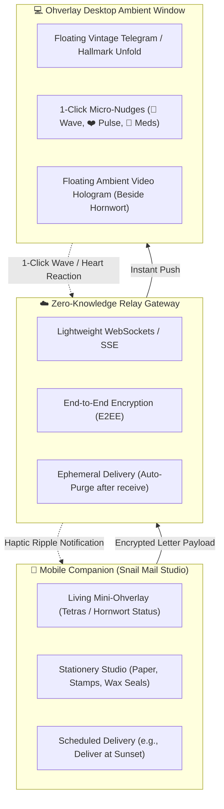

# 🕊️ Ohverlay Telegrama & Snail Mail Platform: Master Vision & Roadmap

> *"Reviving the timeless beauty of vintage handwritten letters, Hallmark cards, and telegrams — integrated seamlessly as a calming, living ambient desktop and mobile companion for families and loved ones across the globe."*

---

## 🌟 Executive Vision & Product Identity

### 1. The Core Purpose: "Slow, Thoughtful Communication"
Modern messaging platforms (WhatsApp, Messenger, Telegram) have become noisy, high-pressure streams of notifications, endless group chats, and urgent pings. 

**Ohverlay Telegrama** is the antidote:
* **Digital Snail Mail**: Letters, cards, and telegrams that carry emotional weight, beauty, and patience.
* **Ambient Desktop Postbox**: For Overseas Filipino Workers (OFWs), long-distance couples, and separated families. A loved one’s note floats gently onto the computer screen beside living aquatic plants and swimming neon tetras, unfolds with a wax seal, and fades into memory or a private keepsake journal.
* **Heritage & Partnerships**:
  * **Hallmark Style**: 3D unfolding greeting cards with authentic parchment textures, deckled edges, and hand-written calligraphy. Target future brand partnership with Hallmark for authentic digital card collections.
  * **Classic Telegram Heritage**: A nostalgic homage to the golden era of Western Union and AT&T telegrams—short, vital, heartfelt messages delivered straight to your personal space.

---

## 🧩 Architectural Pillars & Features

---

### Pillar 1: Desktop Ambient Telegrama (The Postbox)
* **Visual Aesthetics**:
  * Handwritten calligraphy web fonts (*Cedarville Cursive*, *Caveat*, *Marck Script*, vintage typewriter *Special Elite*).
  * 3D paper folding/unfolding animations with crackling wax seal and vintage postmarks (e.g., *"Manila to Dubai — Air Mail"*).
  * Gentle, peaceful sound design (soft paper rustle, quill stroke, subtle bell chime).
* **1-Click Micro-Interactions (For Busy Loved Ones)**:
  * When a user is busy working, coding, or browsing, they shouldn't need to switch contexts to write a full reply.
  * Quick reaction bar directly on the desktop overlay:
    * 👋 **"Wave"**: Quick acknowledge (*"Nakita ko, kumakaway ako sa'yo"*).
    * ❤️ **"Heart Pulse"**: Sends a warm loving glow back to mobile.
    * ☕ **"Coffee Break"**: Let them know you're resting.
    * 💊 **"Medicine Taken"**: Instant peace of mind for family care.
  * Clicking any reaction immediately sends a push event to the sender's mobile phone with a gentle haptic vibration and floating icon.

---

### Pillar 2: Mobile Companion App (Snail Mail Studio)
* **Living Status Header (Mini-Ohverlay)**:
  * Top bar features calm, swimming neon tetras or a gently swaying hornwort stem matching the desktop's live state, serving as an ambient presence indicator (knowing your partner's computer is awake and active).
* **Stationery & Wax Studio**:
  * Selection of vintage papers (creamy vellum, aged parchment, floral pressed paper).
  * Customizable wax stamps (monograms, heart seals, nature leaves).
  * Postal rubber stamps with custom origin and destination cities.

---

### Pillar 3: Floating Ambient Video Presence (Hologram Beside Hornwort)
* **The Problem with Traditional Video Calls**:
  * Zoom, Meet, and FaceTime force large, opaque rectangular windows that cover your desktop work and require active staring.
* **The Ohverlay Solution**:
  * **Holographic Floating Portrait**: A borderless, semi-transparent circular or soft-vignetted video bubble floating at the bottom-right of the screen, right beside the Hornwort plant and Neon Tetras.
  * **Soft Feathered Gradient Mask**: `mask-image: radial-gradient(...)` blends the video seamlessly into your wallpaper without rigid frames.
  * **Click-Through Support (`WS_EX_TRANSPARENT`)**: The user can continue typing, working on spreadsheets, or writing code without mouse clicks being blocked.
  * **Gentle Presence**: Low-profile, intimate, calming ambient presence—feeling together without the stress of an intrusive video window.

---

### Pillar 4: The \$1 USD Overlay Marketplace
* **Business Model**:
  * Base Ohverlay application and essential nature overlays remain free/accessible.
  * **\$1 USD Micro-Overlays**: Users purchase new, high-craft ambient overlays on our website marketplace for \$1 each (via Stripe, GCash, PayPal):
    * **Fauna**: Rare Neon Blue Tetras, Koi Fish, Bioluminescent Jellyfish, Cherry Blossom Petals, Fireflies, Dragonflies.
    * **Flora**: Bonsai Tree with daily growth, Amazonian Sword, Lotus Blossom.
    * **Stationery Packs**: Vintage Victorian letters, Christmas Hallmark cards, Valentine Origami swans.
    * **Atmosphere**: Rain on glass, floating lanterns, Aurora Borealis.

---

## 🗺️ Execution Roadmap & Milestones

### Phase 1: Local Foundation & Aquatic Ecosystem (Current — Completed ✅)
- [x] High-performance WebGL Neon Tetra schooling and autonomous wandering.
- [x] Hornwort procedural botanical growth with realistic nodal leaves and physics sway.
- [x] Bubble generation directly from fish snout tip and plant buds with straight calm ascent.
- [x] Synchronized fish-plant interaction (water wake impulse when fish cruise by).
- [x] Realistic food flake feeding with 30-minute interval and manual feed trigger.
- [x] Hornwort growth speed clamped to natural rates (**1x, 2x, 3x, 4x, 5x**).
- [x] Local Telegrama HTTP server and desktop paper overlay prototype.

### Phase 2: Hallmark Cards & 2-Way Desktop Nudges (Next Priority 🎯)
- [ ] Implement CSS 3D folding/unfolding Hallmark greeting card animation in `telegrama-overlay.html`.
- [ ] Add 1-Click Micro-Reactions (👋 Wave, ❤️ Heart, ☕ Coffee, 💊 Meds) directly to the desktop overlay card.
- [ ] Audio design: subtle paper unfolding and stamp sounds with volume control.
- [ ] Local letter archive/keepsake box (`~/.ohverlay/keepsakes/`).

### Phase 3: Global Cloud Relay & Mobile PWA
- [ ] Deploy zero-knowledge Cloudflare Workers / Go WebSocket relay gateway.
- [ ] QR Code One-Touch Pairing (connect mobile phone to desktop in 3 seconds).
- [ ] Mobile PWA with responsive Snail Mail drafting UI and real-time reaction alerts.
- [ ] End-to-End Encryption (E2EE) using Web Crypto API.

### Phase 4: Floating Ambient Video Presence (Hologram)
- [ ] Integrate WebRTC peer-to-peer transparent canvas streaming.
- [ ] Implement circular soft-feathered edge shader / CSS vignette.
- [ ] Add opacity slider (30% to 100%) and click-through toggle hotkey.
- [ ] Position neatly beside the Hornwort aquarium corner.

### Phase 5: Web Store & \$1 USD Marketplace
- [ ] Launch `ohverlay.com` marketplace catalog.
- [ ] Integrate \$1 payment checkout (GCash, Stripe, Cards).
- [ ] One-click overlay installation (.ohv bundle / instant download to app).
- [ ] Artist submission portal for community cards and overlays.
